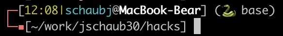

# hacks
Setup/install new MacOS/Linux environment in a repeatable manner.

Inspired by [stupid unix tricks](https://sneak.berlin/20191011/stupid-unix-tricks/).

Naturally, most of the code involves setting my prompt correctly 

```bash
make shell  # use modular .bashrc
make brew   # install homebrew packages (Mac)
make vim    # setup vim
```
